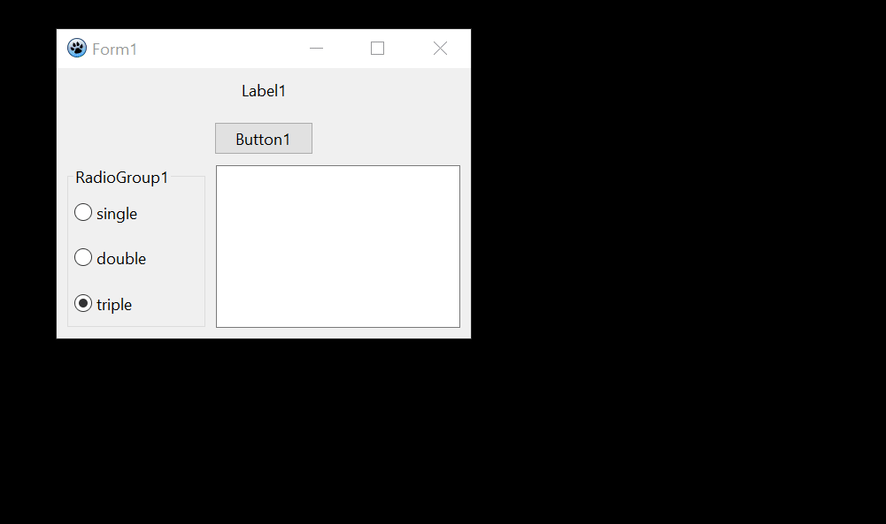
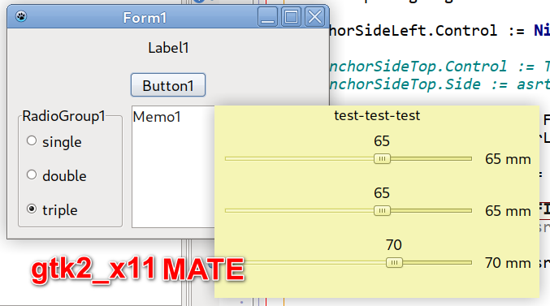
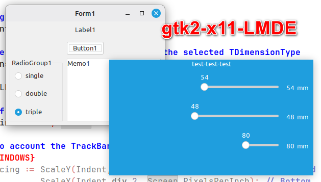
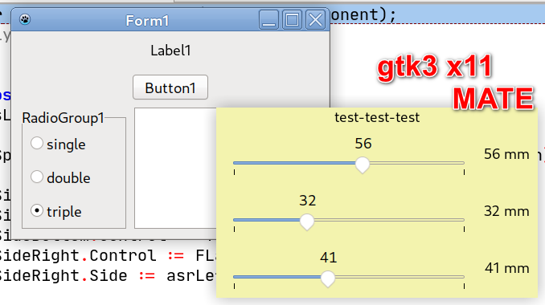
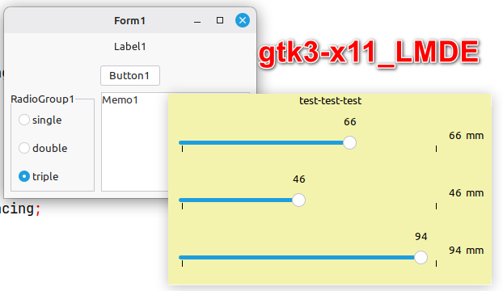
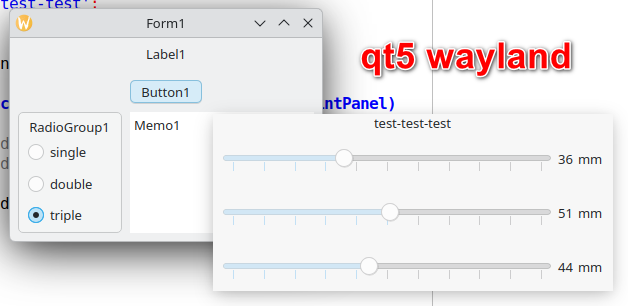
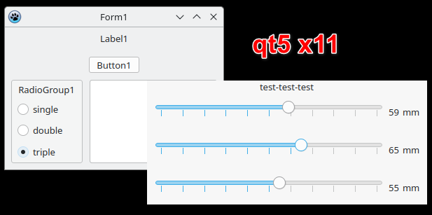
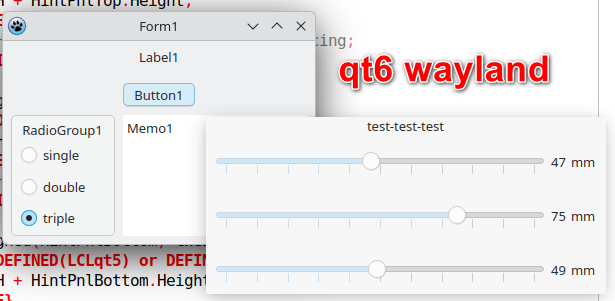
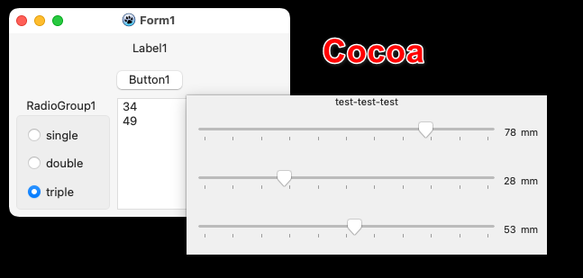

# laz_hint_window

This is a learning project for creating a THintWindow successor with runtime controls. The project was created solely to study how the window will behave in various widgets (gtk2/gtk3/qt5/qt6/Cocoa) and window managers (x11/wayland)
  
  

  
#### other screenshots:

  

  

  

  

  

  

  

  

